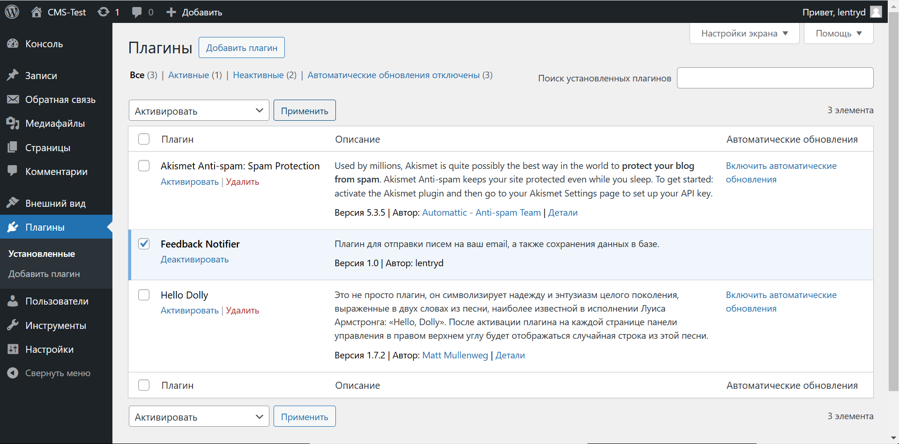
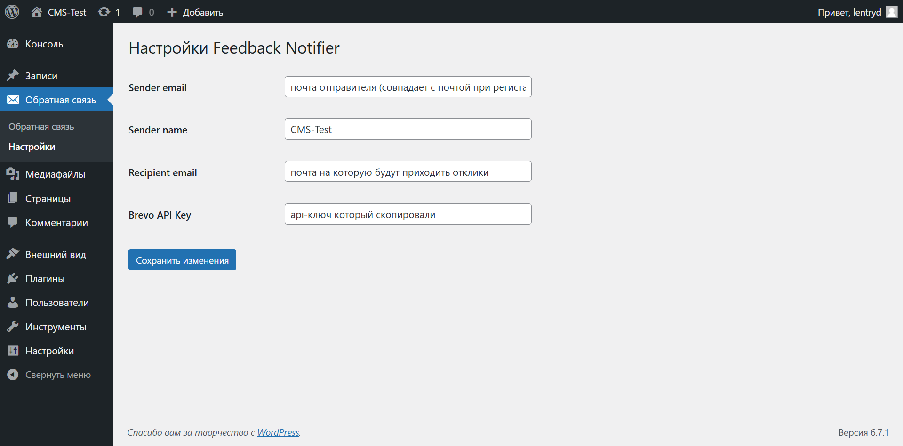
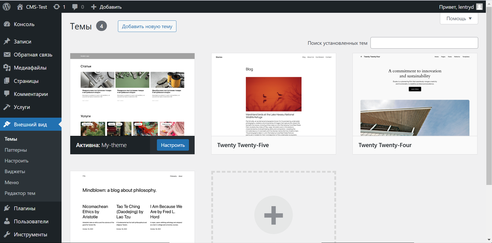

# Тестовое задание «Rocket Business»

## Описание

Этот проект включает настройку WordPress с использованием Docker и плагина для обработки формы обратной связи. Включена интеграция с сервисом отправки писем [Brevo](https://www.brevo.com/).

---

## Требования

Перед началом работы убедитесь, что на вашем сервере установлен Docker. Для проверки выполните команду:

```bash
docker -v
```

Если Docker не установлен, следуйте [этой инструкции](https://timeweb.cloud/tutorials/docker/kak-ustanovit-docker-na-ubuntu-22-04).

---

## Запуск

1. **Настройка переменных**  
   Откройте файл `docker-compose.yml` и укажите свои параметры для базы данных и WordPress.

2. **Запуск Docker-контейнеров**  
   В терминале, находясь в папке проекта, выполните команду:

   ```bash
   docker-compose up -d
   ```

3. **Первичная настройка WordPress**  
   Перейдите в браузере по адресу, указанному Docker, и выполните базовую настройку WordPress.

4. **Активация плагина обратной связи**  
   Перейдите в раздел "Плагины" в админ-панели WordPress и активируйте плагин.  
     

   После активации в меню появится пункт "Обратная связь", где вы сможете просматривать отклики и настраивать отправку сообщений.

5. **Настройка сервиса отправки почты**  
   На текущий момент отправка писем осуществляется через [Brevo](https://www.brevo.com/).  

   - Зарегистрируйтесь на [Brevo](https://onboarding.brevo.com/account/register).
   - Создайте [API-ключ](https://app.brevo.com/settings/keys/api) и скопируйте его.
   - Перейдите в настройки плагина почты и укажите полученный ключ.  
       

     > Почта отправителя должна совпадать с адресом, указанным в [списке отправителей Brevo](https://app.brevo.com/senders/list).

6. **Активация темы**  
   Выберите тему в разделе "Внешний вид" → "Темы" и активируйте её.  
     

---

## Поддержка

Если у вас возникнут вопросы по настройке или запуску, обратитесь к автору проекта.
